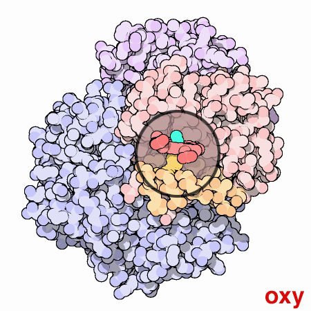
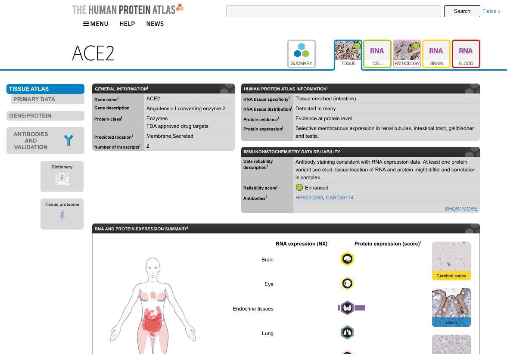
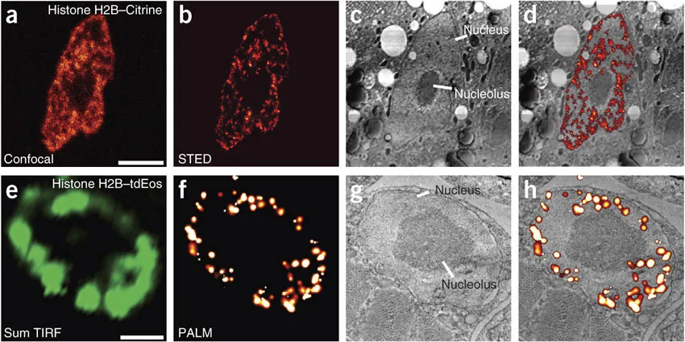
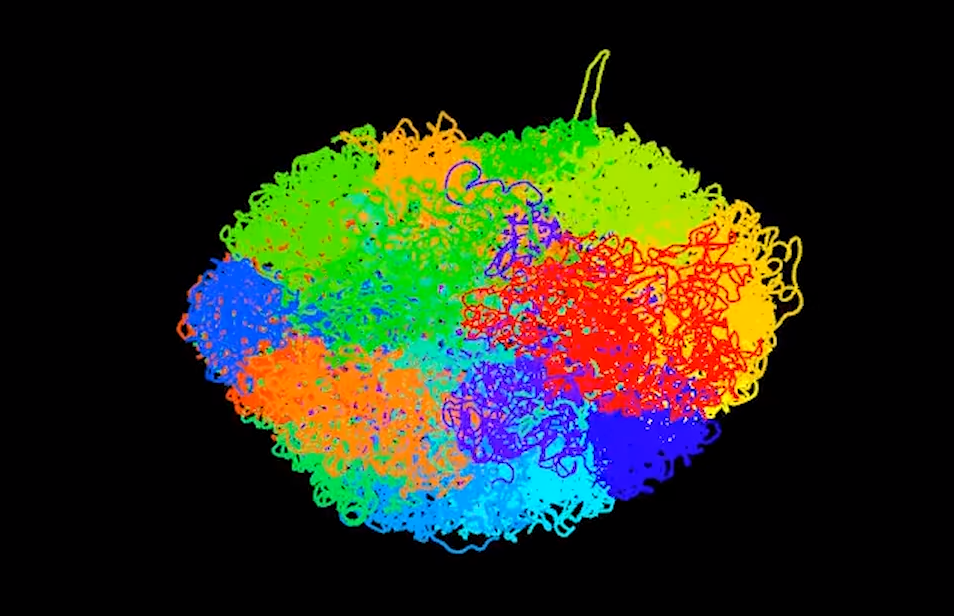
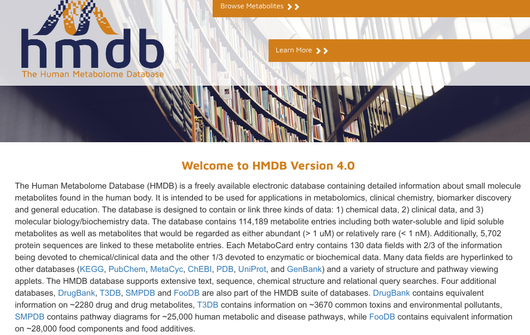
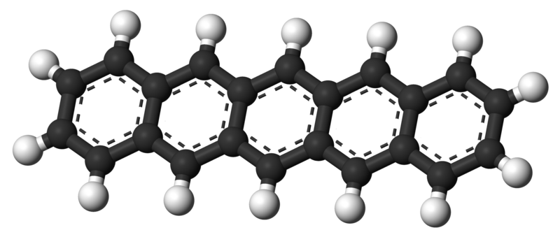
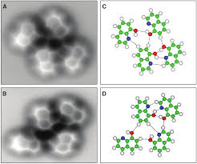

class: center, middle

# Studying biological changes with metabolomics and proteomics

Egon Willighagen

http://chem-bla-ics.blogspot.com/ 
[@egonwillighagen](https://twitter.com/egonwillighagen) 
ORCID:[0000-0001-7542-0286](https://orcid.org/0000-0001-7542-0286) 

MSB1006

CC-BY 4.0 Int.

---

# Metabolomes and Proteomes

Source: [http://pdb101.rcsb.org/motm/41](http://pdb101.rcsb.org/motm/41)

---

# The Human Proteome

Source: [https://www.proteinatlas.org/ENSG00000130234-ACE2/tissue](https://www.proteinatlas.org/ENSG00000130234-ACE2/tissue)

---

# Proteins find there way

Source: Nature Methods, 8, 80–84 (2011) doi:[10.1038/nmeth.1537](https://doi.org/10.1038/nmeth.1537)

---

# DNA packing in the nucleus

Source: Lieberman-Aiden, et al., Oct. 2009. Science 326 (5950), 289-293. doi:[10.1126/science.1181369](https://doi.org/10.1126/science.1181369)
Youtube: [https://www.youtube.com/watch?v=1Fyq9ul9N9Q](https://www.youtube.com/watch?v=1Fyq9ul9N9Q)

---

# The Human Metabolome

Source: Wishart et al. HMDB 4.0, NAR 2017 doi:[10.1093/nar/gkx1089](https://doi.org/10.1093/nar/gkx1089)

---

# WikiPathways → Mapping Life

<iframe src ="https://www.wikipathways.org/index.php/Pathway:WP465?view=widget" width="800px" height="500px" style="overflow:hidden;"></iframe>

---

# Can we see atoms or bonds?

Source: [https://www.chemistryworld.com/news/tuning-in-to-afm/2500506.article](https://www.chemistryworld.com/news/tuning-in-to-afm/2500506.article)

Source: [https://commons.wikimedia.org/wiki/File:Pentacene-3D-balls.png](https://commons.wikimedia.org/wiki/File:Pentacene-3D-balls.png)

---

# Can we see hydrogen bonds?

Source: Zhang et al. Science 2013. doi:[10.1126/science.1242603](https://doi.org/10.1126/science.1242603)

---

# Can we see IRL?

---

# Can we see IRL?

---

# IL-6 Signalling Pathway

---

# Because proteins ...

---

# Omics Recap #1

---

# Vosible Metabolomics: NMR of urine

---

# Visible Proteome

---

#  Visible Metabolomics: NMR of blood

---

# "Smellable" Metabolome: Asthma

---

# What we measure in human samples

---

# What do we want to know?

---

# Measureing the metabolome

---

# Measureing the metabolome

---

# RT Peak alignment

---

# Data Analysis: an example diagram

---

# Without identification?

---

# Metabolite Databases: MassBank

---

# m/z to structure?

---

# From characterization to identity

---

# Protein Fragmentation

---

# Databases & Identifiers

---

# Acid/Base conjugates

---

# BridgeDb

---

# Experimental DAta

---

# Summary

 * We can *measure* a good part of the metabolomics and proteomes
 * Study *differences* in abundance (ill/normal, young/old, etc)
 * *characterization != identity*
 * With identification we can do *pathway analysis*
 * But without we can already do tons of useful *statistical analysis*!

